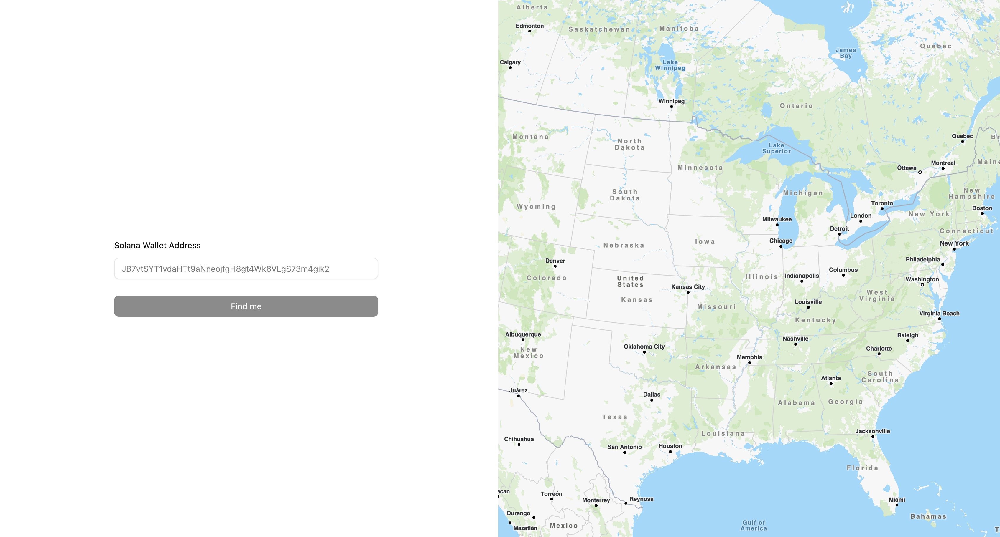

# Wallet Geo Finder

  

### 🎮 Live demo

https://wallet-geo-finder.onrender.com/

### 🚀 Overview

Enter a Solana wallet address to analyze transaction timestamps statistically. Identifies peak activity hours (awake time) vs low activity (sleep time), performs timezone matching, and estimates possible geolocation.


<div align="center">  </div>


### 🖼 Usage

Input any Solana wallet address to get instant timezone and location analysis.

1. Enter wallet address.
2. Review histogram of transaction activity by hour.
3. Find awake hours (high activity) and sleep hours (low activity)
4. Recieve an automatic timezone and geolocation match.

### 💻 Local Setup

```bash
pnpm install
pnpm dev
```


